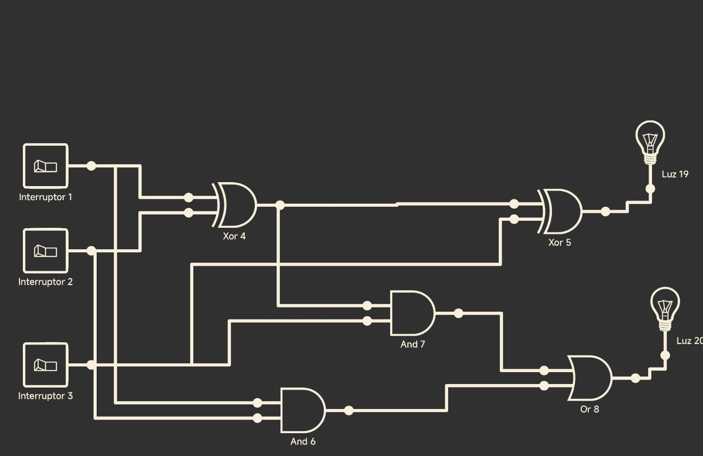
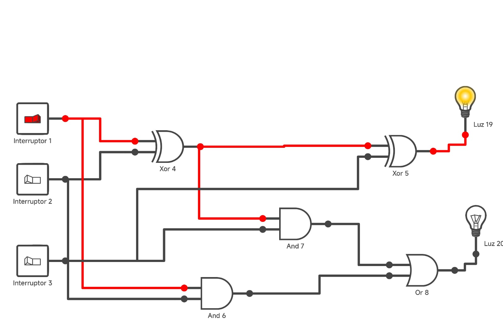
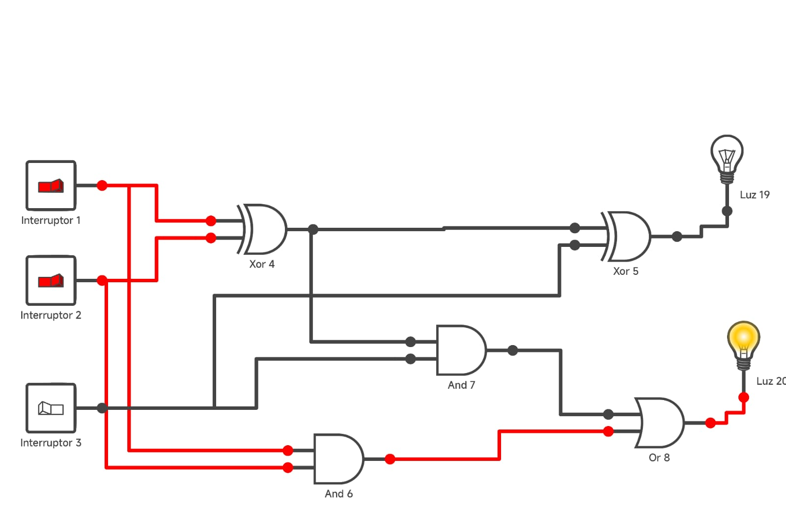
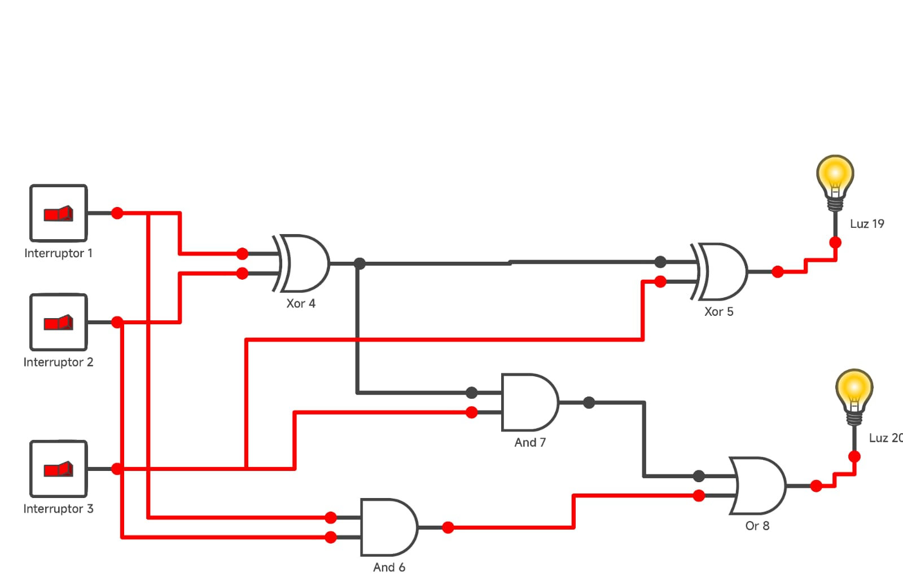

# Sumador y restador de 4 bits con compuertas logicas

## Manual de uso

Ejecucion desde terminal:

```
python3 Sumador.py
```

Flujo operativo:

1. Seleccione la operacion: `S` para suma o `R` para resta.
2. Indique el formato de entrada: `B` (binario) o `D` (decimal).
3. Ingrese los valores solicitados. En binario se requieren exactamente 4 bits;
	 en decimal, el rango valido es de 0 a 15.
4. Revise la salida: se presenta el valor en binario con su equivalente en
	 decimal, junto con el bit de acarreo (suma) o el indicador de prestamo
	 (resta).

Notas de uso:

- El calculo se realiza con el sumador de 4 bits; no se usan operadores
	aritmeticos nativos para la suma de los bits.
- Si la entrada es invalida, el programa muestra un mensaje y termina el
	proceso interactivo.

## Imagen del sumador

Representación Lógica del sumador.



Este circuito corresponde únicamente a un sumador de un bit. Sin embargo, es posible extender su funcionamiento para que actúe también como un sumador–restador de un bit, interpretando la resta como una operación de suma. Para lograr esto, se utiliza el complemento a dos de los números binarios, ya que este método permite representar y operar correctamente con números con signo.


## Fundamentos teoricos

Un bit es la unidad minima de informacion y toma valores 0 o 1. Un numero de
4 bits se representa con cuatro bits fijos (por ejemplo, 0101).

Las compuertas logicas usadas son AND, OR y NOT. A partir de ellas se define
XOR mediante la equivalencia:

```
XOR(A, B) = (A OR B) AND NOT (A AND B)
```

El medio sumador suma dos bits y produce un bit de suma y un acarreo:

```
S = A XOR B
C = A AND B
```

El sumador completo agrega un tercer bit de entrada (acarreo de entrada):

```
S = A XOR B XOR C_in
C_out = (A AND B) OR (C_in AND (A XOR B))
```

Tabla de verdad del sumador completo:

```
A B C_in | S C_out
0 0 0    | 0   0
0 0 1    | 1   0
0 1 0    | 1   0
0 1 1    | 0   1
1 0 0    | 1   0
1 0 1    | 0   1
1 1 0    | 0   1
1 1 1    | 1   1
```

Imagenes de casos especificos:



Caso A=1, B=0, C_in=0: solo hay un 1 en las entradas, por lo que la suma es
S=1 y no se genera acarreo (C_out=0).



Caso A=1, B=1, C_in=0: dos unos generan una suma de 2 en binario, lo que deja
S=0 y produce acarreo (C_out=1).



Caso A=1, B=1, C_in=1: tres unos equivalen a 3 en decimal, que en 2 bits es
11, por lo tanto S=1 y C_out=1.

La resta se implementa con complemento a dos. Para calcular $A - B$, primero
se obtiene el complemento a dos de $B$: se invierten sus bits (NOT) y luego
se suma 1. Ese valor se suma a $A$ con el mismo sumador de 4 bits. El bit de
acarreo final se interpreta como indicacion de prestamo: si es 1, la resta no
requiere prestamo (resultado no negativo en 4 bits); si es 0, el resultado es
negativo en representacion de 4 bits.

En complemento a dos de 4 bits, el rango representable es $[-8, 7]$. Para
obtener $-B$ se toma el complemento a dos de $B$ y se descarta cualquier
acarreo de quinto bit. Por ejemplo, si $B = 0011$ entonces su complemento a
uno es $1100$ y al sumar 1 se obtiene $1101$, que representa $-3$ en 4 bits.
Este principio permite reutilizar el mismo sumador para la resta, ya que
$A - B = A + (\text{comp2}(B))$.

## Ejemplos numericos

Suma de 4 bits con acarreo:

```
A = 0111 (7)
B = 1001 (9)
Suma = 0000 (0)
Carry = 1
```

Resta con complemento a dos:

```
A = 1000 (8)
B = 0011 (3)
comp2(B) = 1101 (-3 en 4 bits)
A + comp2(B) = 0101 (5)
Prestamo = 1
```

## Representacion logica del sumador y restador de 4 bits

El sumador de 4 bits se construye encadenando cuatro sumadores completos en
configuracion ripple-carry. El acarreo de cada etapa se propaga a la siguiente
posicion mas significativa. La resta reutiliza el mismo camino logico al
aplicar complemento a dos a la entrada B.

## Flujo del programa

El programa inicia mostrando un encabezado y ejemplos automaticos. Luego
solicita la operacion (suma o resta) y el formato de entrada (binario o
decimal). Si la entrada es decimal, se convierte a 4 bits mediante un parseo
manual y una descomposicion por base 2, sin realizar la suma con operadores
aritmeticos nativos. El resultado se imprime en binario con su equivalente
decimal, junto con el bit de acarreo o prestamo.

## Requisitos del sistema

- Python 3.x
- Terminal o entorno que permita ejecutar archivos .py

## Estructura de los archivos

| Archivo | Responsabilidad |
| --- | --- |
| Sumador.py | Punto de entrada del programa |
| compuertas.py | AND, OR, NOT y XOR construido |
| operaciones_bits.py | Sumador completo, suma y resta de 4 bits |
| interfaz.py | Entrada/salida, validacion y ejemplos |

## Ejemplo de uso

Ejecucion:

```
python3 Sumador.py
```

Ejemplo con entrada decimal:

```
Operacion (S=suma, R=resta): S
Formato (B=binario, D=decimal): D
A (0 a 15): 7
B (0 a 15): 9
A: 0111 (7)
B: 1001 (9)
Resultado: 0000 (0)
Carry: 1
```


